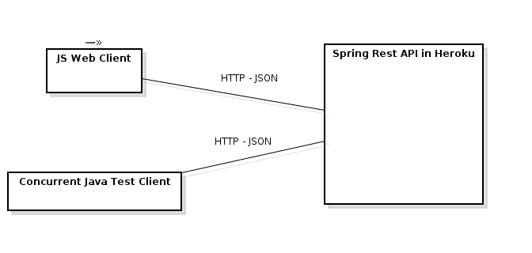

# Parcial Final
## Arquitecturas de Software - ARSW
## Escuela Colombiana de Ingeniería Julio Garavito

- Daniela González
- [Link de heroku](https://parcialfinal-arsw.herokuapp.com/)

## Descripción arquitectura

La arquitectura esta compuesta por un cliente en Javascript, un controlador SpringBoot para aceptar multiples peticiones HTTP realizadas desde un cliente WEB, el controlador tiene inyectado un servicio que se encarga de realizar las conversiones de grados Celsius a Fahrenheit y de Fahrenheit a Celsius y retornarlas al cliente JS. La aplicacion puede ser extendida para utilizar API externos que realicen las conversiones con solo inyectar el servicio externo.

